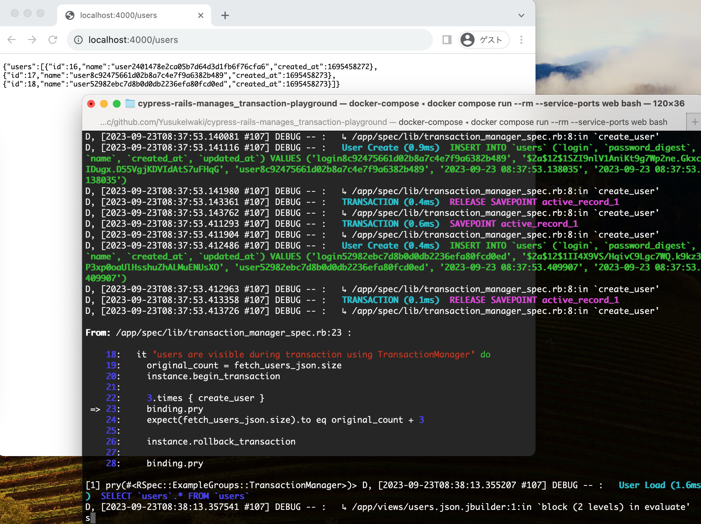
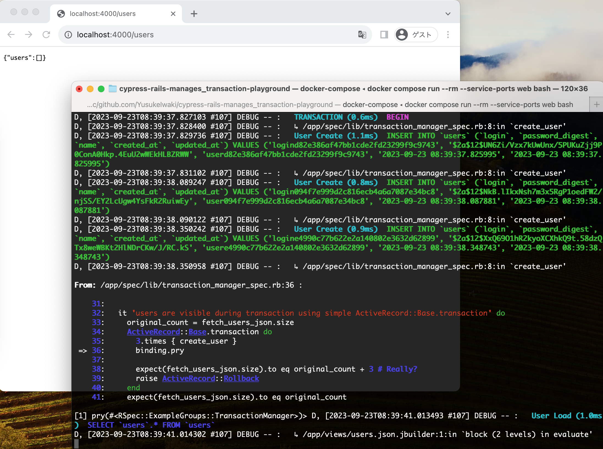
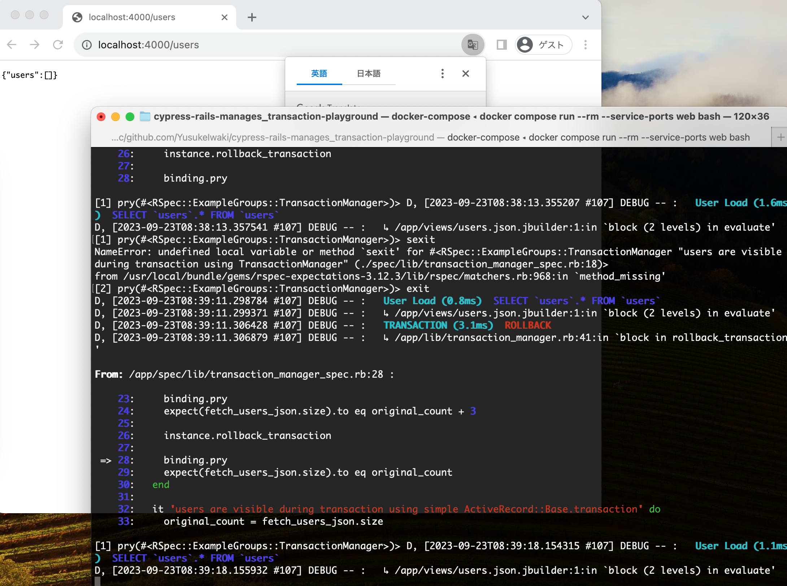

# Playground for ManagesTransactions used in [cypress-rails](https://github.com/testdouble/cypress-rails/blob/v0.6.1/lib/cypress-rails/manages_transactions.rb)

```rb
require 'spec_helper'
require 'securerandom'

RSpec.describe TransactionManager do
  def create_user
    identifier = SecureRandom.hex(16)
    User.create!(name: "user#{identifier}", login: "login#{identifier}", password: "password#{identifier}!!!")
  end

  def fetch_users_json
    res = JSON.parse(Faraday.get('http://localhost:4000/users').body)
    res['users']
  end

  let(:instance) { TransactionManager.instance }

  it 'users are visible during transaction using TransactionManager' do
    original_count = fetch_users_json.size
    instance.begin_transaction
    3.times { create_user }
    expect(fetch_users_json.size).to eq original_count + 3
    instance.rollback_transaction
    expect(fetch_users_json.size).to eq original_count
  end

  it 'users are visible during transaction using simple ActiveRecord::Base.transaction' do
    original_count = fetch_users_json.size
    ActiveRecord::Base.transaction do
      3.times { create_user }
      expect(fetch_users_json.size).to eq original_count + 3 # <--- Really?
      raise ActiveRecord::Rollback
    end
    expect(fetch_users_json.size).to eq original_count
  end
end
```

## test

ManagesTransactions (based on ActiveRecord::TestFixtures) seems more powerful than ActiveRecord::Base.transaction.

```
$ docker-compose run --rm --service-ports web bash
1460f4b97d60:/app# bundle install
1460f4b97d60:/app# bundle exec ridgepole -c config/database.yml -a
1460f4b97d60:/app# bundle exec rspec spec/lib/transaction_manager_spec.rb
```

```
Failures:

  1) TransactionManager users are visible during transaction using simple ActiveRecord::Base.transaction
     Failure/Error: expect(fetch_users_json.size).to eq original_count + 3

       expected: 3
            got: 0

       (compared using ==)
     # ./spec/lib/transaction_manager_spec.rb:30:in `block (3 levels) in <top (required)>'
```

### We can also observe the behavior with browser.

| ManageTransactions                  | ActiveRecord::Base.transaction      |
| ----------------------------------- | ----------------------------------- |
|  |  |

after rollback with ManageTransactions


